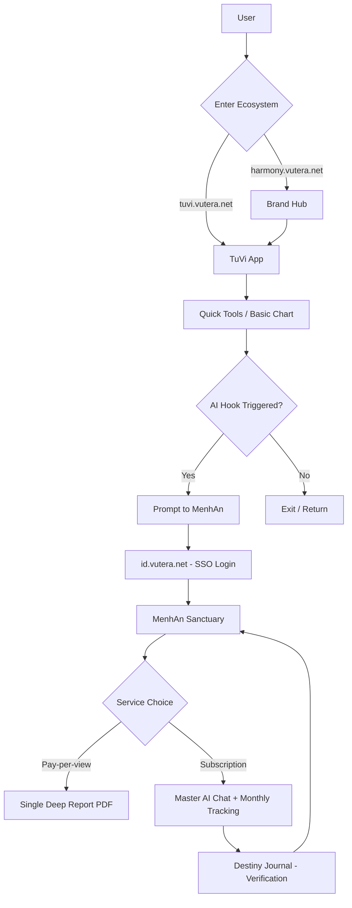
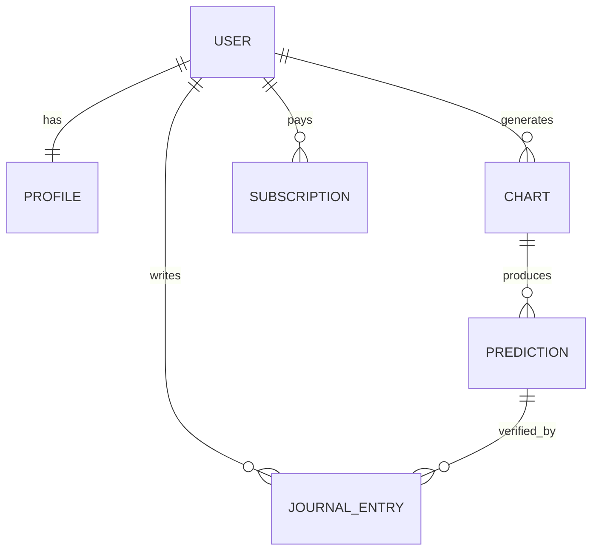

# PRD: HỆ SINH THÁI HARMONY AI

## I. Product Overview

**1.1 Product Vision**
Harmony AI là một "Sanctuary Kỹ Thuật Số" cao cấp, kết hợp tri thức tử vi, phong thủy cổ truyền với trí tuệ nhân tạo hiện đại. Sản phẩm không chỉ cung cấp kết quả tra cứu mà đóng vai trò là một **AI Mentor (The Master AI)** đồng hành cùng người dùng trong hành trình thấu hiểu bản thân và kiến tạo bình an.

**1.2 Target Users**
- **Modern Seekers**: Người trẻ (22-35 tuổi), đô thị, chịu áp lực cuộc sống, yêu công nghệ, tìm kiếm sự cân bằng tinh thần (healing) và định hướng vận mệnh một cách tinh tế, không mê tín.
- **Decision Makers**: Chủ doanh nghiệp, freelancer cần tìm thời điểm tối ưu (thiên thời) cho các quyết định chiến lược.

**1.3 Use Cases chính**
1. **Tra cứu nhanh (TuVi App)**: User nhập năm sinh $\rightarrow$ Xem ngày tốt xấu/tử vi ngắn hạn $\rightarrow$ Nhận "Hook" từ AI $\rightarrow$ Chuyển sang MenhAn.
2. **Luận giải chuyên sâu (MenhAn App)**: User nhập giờ sinh chính xác $\rightarrow$ Master AI phân tích toàn diện Bát Tự/Tử Vi $\rightarrow$ Nhận lời khuyên cá nhân hóa.
3. **Đối soát vận mệnh (Destiny Journal)**: User ghi lại sự kiện thực tế $\rightarrow$ AI đối chiếu với dự báo $\rightarrow$ Tăng mức độ tin cậy.
4. **Thiết kế phong thủy cá nhân**: Nhập địa chỉ/hướng nhà $\rightarrow$ AI phân tích Cửu Cung Phi Tinh $\rightarrow$ Gợi ý bố trí không gian.

**1.4 Scope**
- **In-scope**:
  - `id.vutera.net`: Hệ thống SSO dùng chung.
  - `harmony.vutera.net`: Landing page giới thiệu & phễu dẫn.
  - `tuvi.vutera.net`: App tra cứu miễn phí, SEO engine, lead capture.
  - `menhan.vutera.net`: Sanctuary cao cấp, Master AI chat, Destiny Journal, PDF Report, Subscription.
- **Out-of-scope**:
  - Xây dựng thư viện tính toán lá số từ đầu (sẽ dùng lib sẵn có hoặc API chuyên dụng).
  - Tư vấn tâm linh trực tiếp bởi con người (chỉ cung cấp AI Mentor).
  - Thanh toán tiền điện tử (chỉ dùng cổng thanh toán fiat truyền thống).

---

## II. WBS — Work Breakdown Structure

```
Harmony AI Ecosystem
├── Identity System (id.vutera.net)
│   ├── Auth Service (OAuth2/OIDC)
│   └── User Profile Management
├── Brand Hub (harmony.vutera.net)
│   ├── Marketing Landing Page
│   └── Traffic Router
├── TuVi App (tuvi.vutera.net)
│   ├── Quick Tools (Lịch vạn niên, Ngày tốt xấu)
│   ├── Basic Chart Generator
│   ├── SEO Content Engine
│   └── Lead Capture System
└── MenhAn Sanctuary (menhan.vutera.net)
    ├── Master AI Engine (Prompt Engineering + RAG)
    ├── Advanced Chart Analysis (Bát Tự, Tử Vi Đẩu Số)
    ├── Destiny Journal (Tracking & Verification)
    ├── PDF Art Report Generator
    └── Subscription & Payment Gateway
```

---

## III. User Flow / Business Flow

**End-to-End Flow**:
`User` $\rightarrow$ `Harmony Landing` $\rightarrow$ `TuVi App (Free)` $\rightarrow$ `The Master AI Hook` $\rightarrow$ `SSO Login` $\rightarrow$ `MenhAn Sanctuary (Premium)` $\rightarrow$ `Subscription/Pay-per-view`.

**Flow Diagram**:


---

## IV. System Logic

### Flow 1: The Master AI Analysis (Core)

**Description**: Quy trình AI nhận dữ liệu lá số và trả về lời luận giải mang phong cách "Bậc thầy".

**Input**:
```json
{
  "userId": "string",
  "birthData": {
    "date": "ISO8601",
    "time": "HH:mm",
    "gender": "male|female",
    "location": "string"
  },
  "query": "string (e.g., 'Sự nghiệp năm nay thế nào?')"
}
```

**Processing**:
1. **Determinism Layer**: Chạy thuật toán tính toán lá số (Tử Vi/Bát Tự) $\rightarrow$ Trả về tập hợp các sao, cung, ngũ hành (Raw Data).
2. **Context Augmentation (RAG)**: Truy xuất kiến thức từ cơ sở dữ liệu chuyên gia về các tổ hợp sao/cung hiện có trong lá số.
3. **Personality Layer (Prompting)**: Đưa Raw Data + Context vào LLM với System Prompt "The Master AI" (Thông thái, ấm áp, không hù dọa).
4. **Refinement**: AI tự kiểm tra tính nhất quán giữa các cung trước khi trả kết quả.

**Output**:
```json
{
  "analysis": "Markdown text with structured sections",
  "energyScore": { "metal": 20, "wood": 30, "water": 10, "fire": 20, "earth": 20 },
  "suggestedActions": ["Action 1", "Action 2"],
  "hookForJournal": "Một điểm đặc biệt cần theo dõi trong 3 tháng tới..."
}
```

**Conditions (Error Cases)**:
- `INVALID_BIRTH_DATA` $\rightarrow$ Yêu cầu nhập lại giờ sinh chính xác.
- `AI_SERVICE_TIMEOUT` $\rightarrow$ Hiển thị "Bridge UI" (Loading) và thông báo "Master AI đang chiêm nghiệm, vui lòng đợi giây lát".

---

### Flow 2: Destiny Journal Verification

**Description**: Người dùng ghi nhận sự kiện thực tế để đối soát với dự báo của AI.

**Processing**:
1. **Event Entry**: User nhập sự kiện (ví dụ: "Ngày 15/4 nhận được offer công việc mới").
2. **Matching**: Hệ thống tìm kiếm trong lịch sử dự báo của Master AI các từ khóa/thời điểm tương ứng.
3. **Confirmation**: AI phân tích mức độ tương đồng $\rightarrow$ Xác nhận "Đúng" $\rightarrow$ Tăng điểm Trust Score cho AI đối với User này.

---

## V. Data Model (ERD)

**Collections/Tables**:

```
User { id, email, passwordHash, ssoId, createdAt }
Profile { userId, fullName, birthDate, birthTime, gender, location, energyType }
Chart { id, userId, chartType (TzVi/BatTu), rawData (JSON), analysisSummary, createdAt }
JournalEntry { id, userId, eventDate, eventDescription, relatedPredictionId, status (verified|mismatch), createdAt }
Subscription { id, userId, planType (Free|AnNhien|BinhAn), status, startDate, endDate }
Prediction { id, userId, content, targetDate, category (Career|Love|Health), isVerified }
```

**ERD**:


---

## VI. API Contract

**Authentication**: Bearer JWT qua `id.vutera.net`.

### 1. TuVi App (Public/Light Auth)
- `GET /api/v1/tools/calendar` $\rightarrow$ Lịch vạn niên & ngày tốt xấu.
- `POST /api/v1/charts/basic` $\rightarrow$ Lập lá số cơ bản (không cần login sâu).

### 2. MenhAn Sanctuary (Private)
- `POST /api/v1/master-ai/analyze` $\rightarrow$ Luận giải chuyên sâu.
- `GET /api/v1/journal` $\rightarrow$ Lấy lịch sử nhật ký vận mệnh.
- `POST /api/v1/journal/entry` $\rightarrow$ Thêm sự kiện đối soát.
- `POST /api/v1/reports/pdf` $\rightarrow$ Generate báo cáo PDF nghệ thuật.

### 3. Identity (id.vutera.net)
- `POST /api/auth/login` $\rightarrow$ Xác thực & cấp token.
- `GET /api/auth/me` $\rightarrow$ Thông tin profile dùng chung.

---

## VII. Business Rules & Edge Cases

**Business Rules**:
- **Paywall**: Các tính năng luận giải chi tiết > 3 cung hoặc chat với Master AI > 5 câu/ngày yêu cầu gói `An Nhiên` hoặc `Bình An`.
- **PDF Generation**: Chỉ cho phép generate tối đa 1 bản PDF "Độc Bản" mỗi quý cho gói subscription, hoặc mua lẻ (Pay-per-view).
- **Data Privacy**: Dữ liệu giờ sinh không bao giờ được hiển thị công khai, chỉ dùng làm input cho AI.

**Edge Cases**:
- **Giờ sinh không chính xác**: AI sẽ cung cấp 2-3 kịch bản có thể xảy ra và yêu cầu User chọn kịch bản khớp với thực tế nhất $\rightarrow$ Cập nhật lại Profile.
- **Xung đột dự báo**: Khi 2 phương pháp (Tử Vi & Bát Tự) cho kết quả trái ngược $\rightarrow$ Master AI đóng vai trò điều phối, giải thích sự mâu thuẫn và đưa ra kết luận tổng hòa.

---

## VIII. Non-functional Requirements

- **Performance**: 
  - Landing page & TuVi App: LCP < 1.2s (SEO focus).
  - Master AI Response: Streaming response để giảm cảm giác chờ đợi (TTFB < 2s).
- **Security**: 
  - HTTPS toàn hệ thống.
  - Mã hóa AES-256 cho dữ liệu Profile nhạy cảm.
  - Rate limiting cho API Master AI để tránh lạm dụng token LLM.
- **Scalability**: 
  - Tách biệt DB cho `id.vutera.net` và các app con để tránh single point of failure.
  - Sử dụng Redis cache cho các kết quả tra cứu ngày tốt xấu phổ thông.

---

## IX. AI Output Quality Check
- [x] Flow đầy đủ: Landing $\rightarrow$ TuVi $\rightarrow$ MenhAn $\rightarrow$ Journal.
- [x] System logic: Đã chi tiết hóa quy trình Master AI và đối soát Journal.
- [x] API match flow: Đã định nghĩa các endpoint cần thiết cho mỗi module.
- [x] Data model: Đầy đủ quan hệ giữa User, Chart, Prediction và Journal.
- [x] Implementability: Dev có thể bắt đầu thiết lập DB và API từ tài liệu này.
